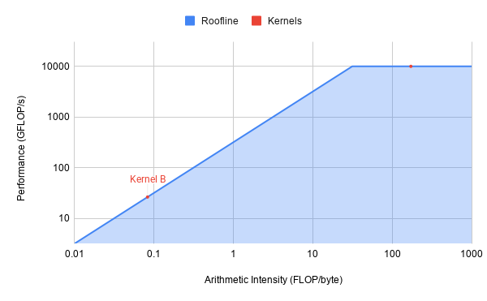

# Roofline Diagram

## GEMM (Kernel A)
N = 1024

FLOPs $= 2 \cdot N^3 = 2 \cdot 1024^3 = 2^31$

Bytes transferred $= 3 \cdot N^2 \cdot 4 = 3 \cdot 1024^2 \cdot 4 = 12582912$ Bytes

AI $= \frac{\text{FLOPs}}{\text{Bytes}} = 170.67$ FLOP/byte

Attainable GLOP/s $= min(170.67 \cdot 320, 10000) = 10000$

This kernel is compute bound. Any improvements would require raising the compute bound ($P_{peak}$).

## Vector-add (Kernel B)
N = 4194304

FLOPs $= N = 4194304$

Bytes transferred $= 3 \cdot N \cdot 4 = 50331648$

AI $= \frac{\text{FLOPs}}{\text{Bytes}} = 0.08$ FLOP/byte

Attainable GLOP/s $= 0.08 \cdot 320 = 26.67$

This kernel is memory bound. There is nothing to be done with the given system, any improvement would need an increase to the DRAM bandwidth.

